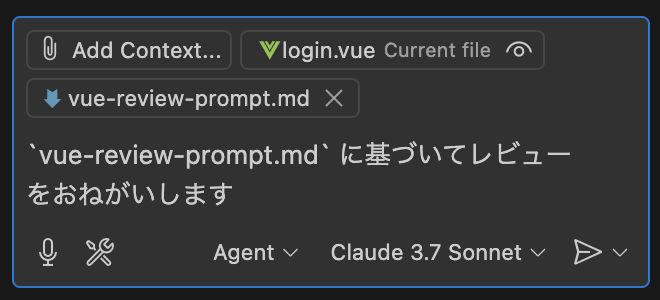
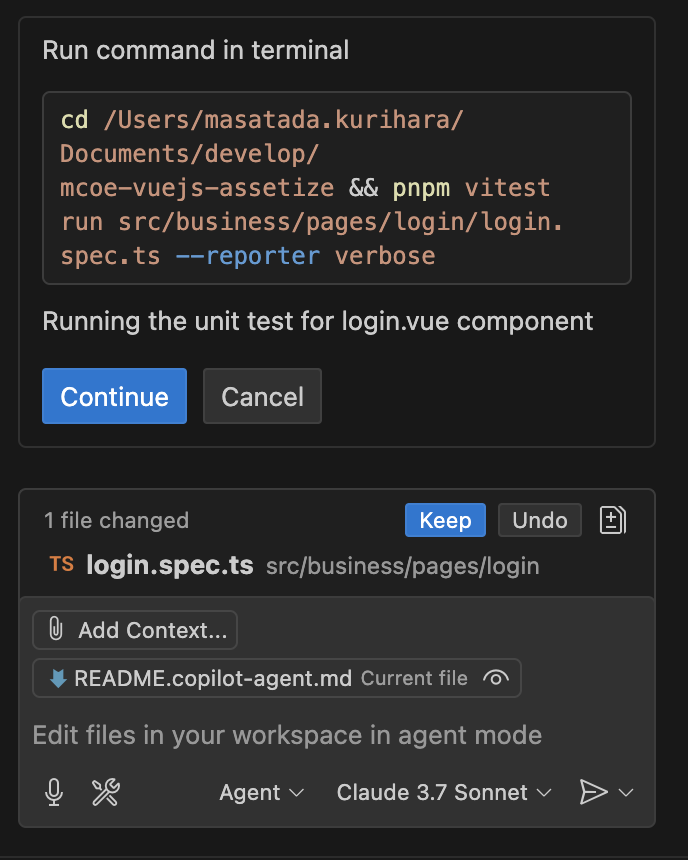

# Utilizing Copilot Agent in ACTS Frontend

## Introduction

The ACTS Frontend leverages the Copilot Agent to perform the following tasks:

- Automatic generation of Repository/Store/Express Mock from OpenAPI definitions
- Code reviews based on the ACTS development guide
- Automated construction of unit tests aiming for 80% coverage
- Assistance in application development based on the ACTS development guide

## Internal Application Process for GitHub Copilot

[Click here](https://teams.microsoft.com/l/message/19:56c07487f37e40e4b2f897e83e6757ff@thread.skype/1711419682863?tenantId=e0793d39-0939-496d-b129-198edd916feb&groupId=2e901c43-bc33-42e5-9c46-8d16d0adacb3&parentMessageId=1711419682863&teamName=CIE%2FIES%20Japan%20All&channelName=001_%E3%82%88%E3%82%8D%E3%81%9A%E6%83%85%E5%A0%B1%E5%85%B1%E6%9C%89&createdTime=1711419682863) for the IES Teams.

**As stated, do not use Copilot without obtaining client approval.**

## Installing Copilot Agent

### Installing Visual Studio Code

First, install the latest [VSCode](https://azure.microsoft.com/ja-jp/products/visual-studio-code). Agent Mode is only enabled on version 1.99.x or later.

### Configuring Visual Studio Code

#### Installing VSCode Extensions

Install the GitHub Copilot Agent extension. For details and installation, refer to the following URLs:

- [GitHub Copilot](https://marketplace.visualstudio.com/items?itemName=GitHub.copilot)
- [GitHub Copilot Chat](https://marketplace.visualstudio.com/items?itemName=GitHub.copilot-chat)

**For prohibited projects, uninstall these two plugins or disable them in settings to avoid using Copilot.**

#### Enabling the Agent

This project enforces activation via [local settings](/.vscode/settings.json). For individual activation, search for `agent` in Preferences->Settings and enable it under `Chat->Agent`.

#### Logging into GitHub

Refer to the [official guide](https://code.visualstudio.com/docs/copilot/setup) to log into Copilot.

- **Always log into GitHub using your Accenture email address. Do not use personal accounts.**
- If you want to use a different account for Copilot than the one linked to VSCode:
  1. Use the command palette (⌘+Shift+P / Ctrl+Shift+P) to `Copilot: Sign Out`.
  2. Similarly, use `Copilot: Sign In` to log in again.

---

## How to Use Copilot Agent

Refer to the [official guidelines](https://code.visualstudio.com/docs/copilot/chat/copilot-chat) for basic usage.

- Primarily use [Agent Mode](https://code.visualstudio.com/docs/copilot/chat/chat-agent-mode):
  1. ASK Mode: A chat window for single-file operations using advanced inference models. For content verification only. Can also consult unrelated technologies.
  2. Edit Mode: A chat window for single-file operations using advanced inference models. For single-file edits only.
  3. Agent Mode: A chat window where AI autonomously operates on multiple files.
  - **Agent Mode uses the Claude 3.7 model.**
    

### copilot-instructions.md

- The base prompt that Copilot adheres to is stored in [copilot-instructions.md](/.github/copilot-instructions.md). All modes operate according to this.
- Update this file based on project requirements to make the Agent AI more accurate.
- By default, the prompt is based on the ACTS development guide.

### Standard Prompts

Several prompts are prepared and stored in [Prompts](/.github/prompts):

- vue-codegen.md
  - [vue-codegen.md](/.github/prompts/vue-codegen.md)
  - [vue-codegen-form.md](/.github/prompts/vue-codegen-form.md)
  - [vue-review-prompt.md](/.github/prompts/vue-review-prompt.md)
  - [vue-test-prompt.md](/.github/prompts/vue-test-prompt.md)
- These are used as prompts for the Copilot Agent. However, since Accenture's GitHub Copilot has the prompt template feature disabled, select them via Add File.
  

#### vue-codegen.md

- A prompt for automatically generating Repository classes, Pinia stores, and Express mock servers from OpenAPI definitions.
- Select the prompt from Add File, then select the target YAML file from Add File to generate the code.
- Specify the domain path and class name for the output in the chat window.

Example:

```markdown
Generate code from these YAML definition files according to the content of `vue-codegen.md`.

Class Name:
`BasicInfo*`

Output Path:
`src/business`
```


#### vue-codegen-form.md

This is essentially the same as `vue-codegen.md` but generates a sample form and screen using Vue 3's Composition API.

#### vue-review-prompt.md

A prompt for conducting code reviews based on the ACTS development guide.

- Open the file to be reviewed in VSCode, then select `vue-review-prompt.md` from Add File.
- Write "Please review based on `vue-review-prompt.md`" in the chat window.
- The Agent can also automatically make corrections based on the review results.

Example:

```markdown
Please review based on `vue-review-prompt.md`.
```



#### vue-test-prompt.md

A prompt for automatically generating unit tests with Vitest aiming for 80% coverage.

- Open the file to be reviewed in VSCode, then select `vue-test-prompt.md` from Add File.
- Write "Please generate unit tests based on `vue-test-prompt.md`" in the chat window.
- The Agent will automatically execute the tests for the generated code.
  - First, press `Keep` to save the file, then press `Continue` to execute the tests.
  - If the tests fail, the Agent will automatically make corrections.
    

Example:

```markdown
Please generate unit tests based on `vue-test-prompt.md`.
```


### vue-commit-message.md

A prompt for generating commit messages for Flutter projects based on staged changes and provided information.

#### Commit Message Rules

- The commit message must follow this format:

```
[<type>] <ticket-no> <subject>

<body>
```

- **type**: One of the following:
  - modify: Feature change/fix
  - add: Feature addition
  - remove: Feature removal
- **ticket-no**: The ticket number (provided via the prompt)
- **subject**: A summary of the staged changes (provided via the prompt or generated automatically, concise within 50 characters)
- **body**: A bulleted list describing the details of the changes

  - Each item should be a clear explanation of what was changed
  - Example:
    - `sample_page.vue`: Fixed network processing to update UI based on API response
    - `user_list_page.vue`: Improved performance by prefetching data during list scroll
    - `user_detail_page.vue`: Improved UI, changed username font size from 15pt to 18pt

- **Full example:**

```
[modify] ACTS-1234 Fix network processing in sample_page.vue

- Fixed network processing in `sample_page.vue` to update UI based on API response
- Improved performance in `user_list_page.vue` by prefetching data during list scroll
- Improved UI in `user_detail_page.vue`, changed username font size from 15pt to 18pt
```

#### How to Use

1. Stage the files you want to commit (`git stage`).
2. In VS Code, select `flutter-commit-message.md` from Add File.
3. In the chat window, specify the ticket number. You can also specify a subject if desired.
   - If you do not specify a subject, the LLM will generate one automatically.
   - Example (ticket only):
     ```
     Please generate a commit message for `ACTS-1234`.
     ```
   - Example (ticket and subject):
     ```
     Please generate a commit message for `ACTS-1234`.
     Subject: Fix network processing in sample_page.vue
     ```
4. After the commit message is generated, confirm before running the commit command:
   - `git commit -m "<commit-message>"`

---

### Tips for Giving Commands in Agent Mode

- By specifying AddFile or file paths concretely in the chat, the Agent can automatically operate on related files.
- To clear the state of Agent Mode, switch to Edit Mode once to reset the state of Agent Mode.
- Clearly state the "intent of the current file" and give explicit instructions.
  - Example: Testing the login function.
  ```markdown
  This file is for the login screen.
  Change the login function to asynchronous and add API error handling.
  ```
- Communicate "purpose" + "constraints" + "output format".

  - Example: Adding validation logic.

  ```markdown
  Create a custom composition for the input validation function on this screen.
  Refer to `src/business/pages/login/login.form.composition.ts` for constructing the custom composition.

  Constraints:

  - Email address must be in the correct format and required.
  - Password must be at least 8 characters long and alphanumeric.
    Return an array of validation error messages.
  ```

---

### Notes

1. **Client Approval**
   Do not use Copilot without obtaining client approval.

2. **Code Reliability**
   Automatically generated code may contain security concerns or potential bugs, so always conduct a review.

3. **Use of MCP**
   [MCP](https://code.visualstudio.com/docs/copilot/chat/mcp-servers) cannot be used under Accenture's current contract. Even if it becomes available, connecting without consulting the project manager, architecture team, or MobileCoE may cause significant security issues.
