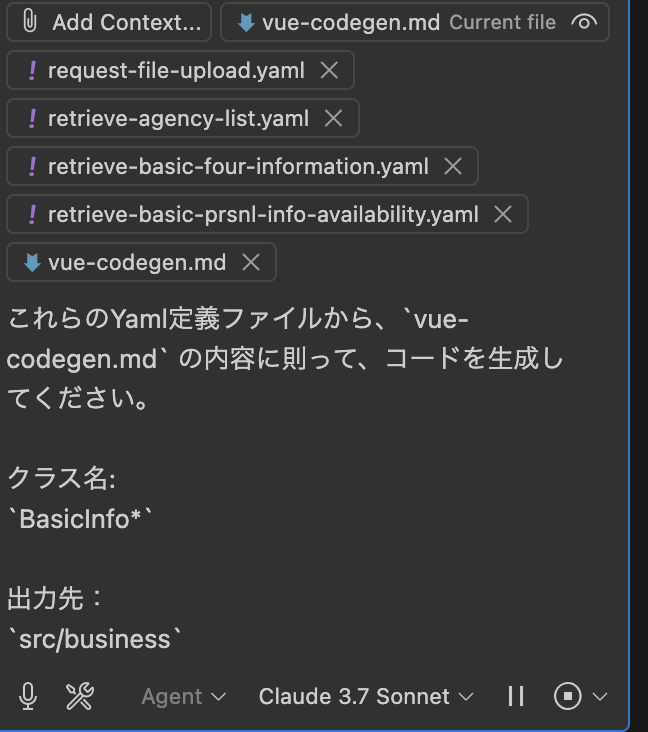
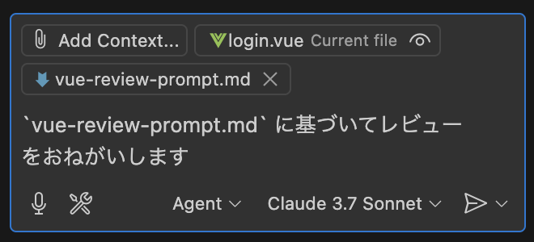
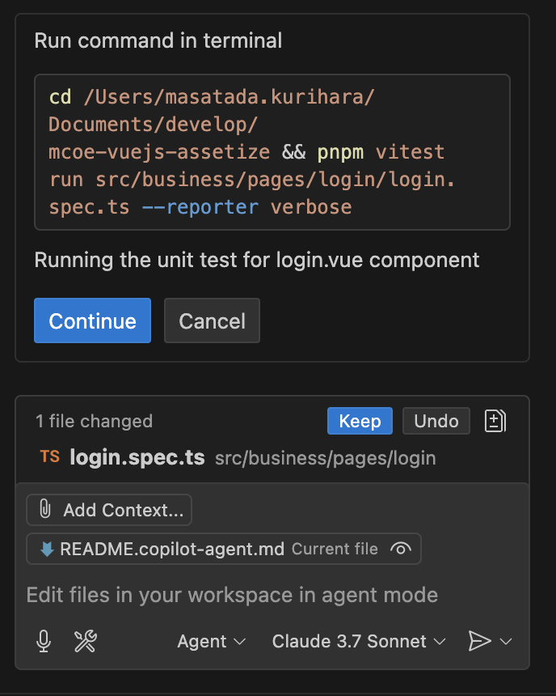
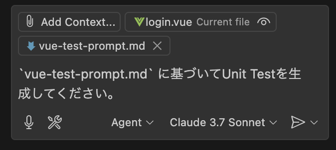

# ACTS FrontendでのCopilot Agent活用

## はじめに

ACTSのFrontendはCopilot Agentを活用し、以下のような事を実施できるようにしている。

- OpenAPI定義からのRepository/Store/ExpressのMockの自動生成
- ACTSの開発ガイドに基づいたコードのレビュー
- カバレッジ率80%を目指すUTの構築の自動化
- ACTSの開発ガイドに基づいたその他アプリケーションの開発補助

## Github Copilotの社内申請窓口

[こちら](https://teams.microsoft.com/l/message/19:56c07487f37e40e4b2f897e83e6757ff@thread.skype/1711419682863?tenantId=e0793d39-0939-496d-b129-198edd916feb&groupId=2e901c43-bc33-42e5-9c46-8d16d0adacb3&parentMessageId=1711419682863&teamName=CIE%2FIES%20Japan%20All&channelName=001_%E3%82%88%E3%82%8D%E3%81%9A%E6%83%85%E5%A0%B1%E5%85%B1%E6%9C%89&createdTime=1711419682863)のIESのTeams。

**記載されている通り、クライアントから許諾を得られていない場合はCopilotを利用してはならない。**

## Copilot Agentの導入

### Visual Studio Codeのインストール

まず最新の[VSCode](https://azure.microsoft.com/ja-jp/products/visual-studio-code)を導入する。1.99.x以上でのみAgentModeは有効となる。

### Visual Studio Codeの設定

#### VSCode拡張機能のインストール

GitHub Copilot Agent拡張機能をインストールします。詳細とインストール先は下記URLをご参照ください。

- [GitHub Copilot](https://marketplace.visualstudio.com/items?itemName=GitHub.copilot)
- [GitHub Copilot Chat](https://marketplace.visualstudio.com/items?itemName=GitHub.copilot-chat)

**逆に禁止されているプロジェクトでは、この2つのプラグインをアンインストール、もしくは設定で無効化することでCopilotの利用を避けることができる**

#### Agentの有効化

基本的にこのプロジェクトは[ローカル設定](/.vscode/settings.json)で強制的に有効化している。
個別有効化が必要であれば、Preferences->Settingsを`agent`で検索し、`Chat->Agent`で有効化を行う。

#### Githubへのログイン

[公式のガイド](https://code.visualstudio.com/docs/copilot/setup)を参考にCopilotへログインする。

- **必ずAccentureのメールアドレスでGithubにログインすること。個人のアカウントは利用してはならない。**
- Copilotで、VSCode側のGithubアカウントとは別のアカウントを使いたい場合
  1. 一度コマンドパレット（⌘+Shift+P / Ctrl+Shift+P）で、 `Copilot: Sign Out` でサインアウトする。
  2. 同様に `Copilot: Sign In` で再度ログインする。

---

## Copilot Agentの使い方

基礎的な使い方は、[公式のガイドライン](https://code.visualstudio.com/docs/copilot/chat/copilot-chat)を参照。

- 基本的に[Agent Mode](https://code.visualstudio.com/docs/copilot/chat/chat-agent-mode)を利用する。
  1. ASK Mode: 単ファイルに対して動作する、高度な推論モデルも使えるチャットウィンドウ。内容の確認のみ。関係ない技術の相談もできる。
  2. Edit Mode: 単ファイルに対して動作する、高度な推論モデルも使えるチャットウィンドウ。単ファイルのエディットのみ。
  3. Agent Mode: 複数ファイルに対して動作する、AIが自律してファイルを操作するチャットウィンドウ。
  - **Agent Modeの選択モデルは、Claude 3.7を利用する。**
    

### copilot-instructions.md

- [copilot-instructions.md](/.github/copilot-instructions.md) に、Copilotが標準で従うベースプロンプトが格納されている。全てのModeは、これに従って動作する。
- プロジェクト要件によってこちらを更新していくことで、より制度の高いAgentAIとして動作する。
- デフォルトではACTS開発ガイドをベースとしたPromptが記載されている。

### 標準Prompt

いくつかのPromptを用意している。これらは、[Prompts](/.github/prompts)に格納されている。

- vue-codegen.md
  - [vue-codegen.md](/.github/prompts/vue-codegen.md)
  - [vue-codegen-form.md](/.github/prompts/vue-codegen-form.md)
  - [vue-review-prompt.md](/.github/prompts/vue-review-prompt.md)
  - [vue-test-prompt.md](/.github/prompts/vue-test-prompt.md)
- これらは、Copilot Agentのプロンプトとして利用される。ただしAccentureのGithub Copilotはプロンプトテンプレート機能が塞がれているため、Add Fileにて選択する。
  

#### vue-codegen.md

- OpenAPI定義からのRepositoryクラス、Piniaストア、Expressのモックサーバーを自動生成するためのプロンプト。
- Add Fileから、プロンプトを選択、その後生成対象のYAMLファイルもAdd Fileから選択することで、生成を行う。
- チャットウィンドウには出力先のドメインパス、クラス名を指定する。

例：

```markdown
これらのYaml定義ファイルから、`vue-codegen.md` の内容に則って、コードを生成してください。

クラス名:
`BasicInfo*`

出力先：
`src/business`
```



#### vue-codegen-form.md

これは基本的に `vue-codegen.md` と同じだが、Vue3のComposition APIを利用したForm、及び画面のサンプルを生成してくれる。

#### vue-review-prompt.md

ACTSの開発ガイドに基づいたコードレビューを行うためのプロンプト。

- レビュー対象のファイルをVSCodeで開いたまま、`vue-review-prompt.md` をAdd Fileから選択する。
- `vue-review-prompt.md` に基づいてレビューをおねがいしますとチャットウィンドウに記載する。
- なお、レビューの結果、その内容についてAgentに自動的に修正を行わせることもできる。

例:

```markdown
`vue-review-prompt.md` に基づいてレビューをおねがいします。
```



#### vue-test-prompt.md

Vitestによるカバレッジ率80%を目指すユニットテストを自動生成するためのプロンプト。

- レビュー対象のファイルをVSCodeで開いたまま、`vue-test-prompt.md` をAdd Fileから選択する。
- `vue-test-prompt.md` に基づいてUnit Testを生成してくださいとチャットウィンドウに記載する。
- なお、生成されたコードに対して、Agentが自動でテストを実行してくれる。
  - 先に`Keep`を押して、ファイルを保存させ、その上で `Continue` を押すことで、テストを実行してくれる。
  - テストが失敗した場合、自動的に修正を行ってくれる。
    

例:

```markdown
`vue-test-prompt.md` に基づいてUnit Testを生成してください。
```



#### vue-commit-message.md

以下のようなメッセージが生成され、メッセージ確認後、`git commit -m <message>` を実行してくれる。

```markdown
[modify] ACTS-1234 sample_page.vueの通信処理の修正

- `sample_page.vue` の通信処理を修正し、APIのレスポンスに基づいてUIを更新するようにした
- `user_list_page.vue` のパフォーマンスを改善するために、リストのスクロール時にデータをプリフェッチするようにした
- `user_detail_page.vue` のUIを改善し、ユーザー名のフォントサイズを15ptから18ptに変更した
```

- コミットメッセージの生成ルールを定義するためのプロンプト。
- Add Fileから、プロンプトを選択し、生成対象のファイルを指定することで、コミットメッセージを生成する。
- まずコミット対象を選択し、`git stage` を実行する。
- その後、`flutter-commit-message.md` をAdd Fileから選択する。
- チャットウィンドウにはチケット番号を指定する。チケットのサブジェクトを指定することも出来る。

  - チケットのサブジェクトを入力しない場合、LLMが自動的に生成してくれる。

- チケット番号のみ指定する例：

  ```
  `ACTS-1234` でコミットメッセージを生成してください。
  ```

- チケットのサブジェクトを指定する例：
  ```
  `ACTS-1234` でコミットメッセージを生成してください。
  サブジェクトは `sample_page.tsの通信処理の修正` です。
  ```

---

### Agent Modeへの命令の行い方Tips

- AddFileやファイルパスを具体的にチャットで指定することで、相関的なファイルをAgentが自動的に操作してくれる。
- Agent Modeの状態をクリアした場合、Edit Modeに一度切り替えることで、Agent Modeの状態をリセットできる。
- 「現在のファイルの意図」を明示し、行動を明示的に指示する。
  - 例：ログイン機能の検証用テストなど。
  ```markdown
  このファイルはログイン画面です。
  ログインの関数を非同期に変えて、APIのエラーハンドリングも追加してください。
  ```
- 「目的」+「制約」+「出力形式」を伝える。

  - 例：バリデーション処理を追加する場合。

  ```markdown
  この画面の入力バリデーション関数をCustom Compositionで作成してください。
  Custom Compositionの構築には、`src/business/pages/login/login.form.composition.ts` を参考にしてください。

  制約：

  - メールアドレスは正しい形式で必須
  - パスワードは8文字以上で英数字混在
    戻り値はバリデーションエラーのメッセージ配列にしてください
  ```

---

### 注意事項

1. **クライアントの許諾**
   クライアントから許諾を得られていない場合、Copilotの利用を行うことはできない。

2. **コードの信頼性**
   自動生成されたコードにはセキュリティ上の懸念、潜在的なバグが含まれる可能性があるため、必ずレビューを実施する.

3. **MCPの利用**
   [MCP](https://code.visualstudio.com/docs/copilot/chat/mcp-servers)は現時点のAccentureの契約では利用することはできない。
   また、もし利用可能となったとしても、勝手に繋いだ場合セキュリティ的に問題が発生する可能性が非常に高いため、プロジェクトの責任者、アーキチーム、MobileCoEにまず相談すること。
